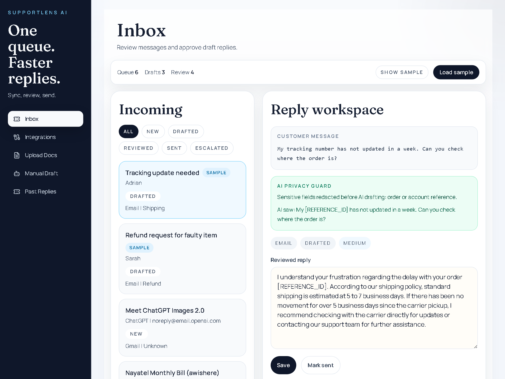
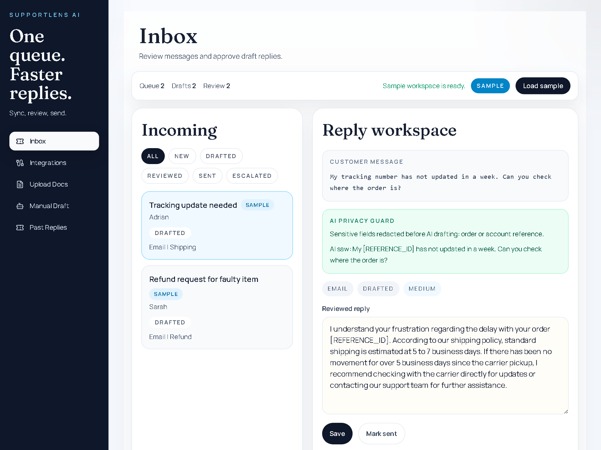
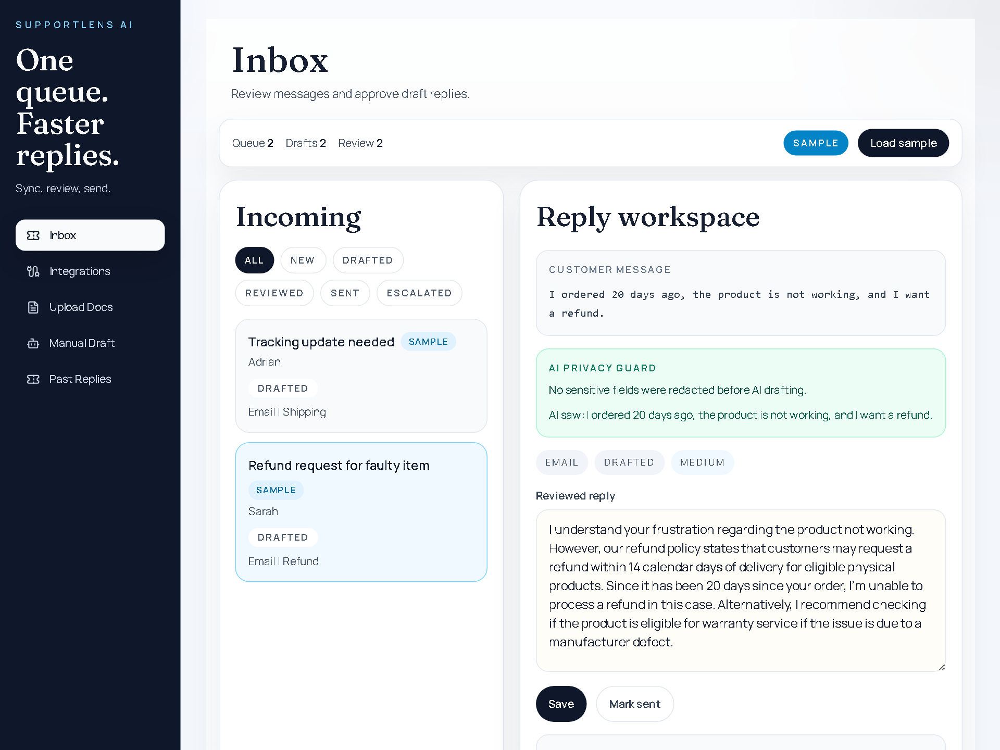
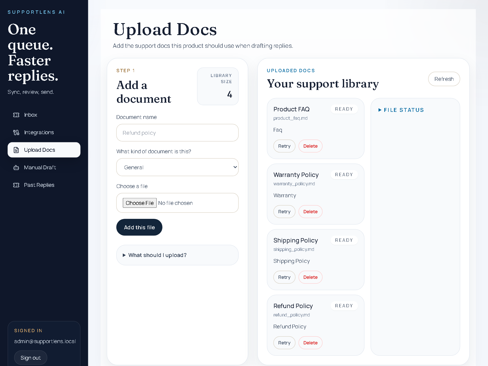

# SupportLens AI Case Study

SupportLens AI is a support inbox copilot that helps teams review customer messages, retrieve policy context, draft replies, and keep a human in control before anything reaches the customer.

The source code is private. This repository documents the product, architecture, security decisions, and engineering work behind the project.

## Proof Links

- Portfolio walkthrough: [anasnaveed.com/case-studies/supportlens-ai.html](https://anasnaveed.com/case-studies/supportlens-ai.html)
- Source status: private, documented here with screenshots and architecture notes
- Best proof signal: practical AI workflow with Gmail OAuth, retrieval, PII redaction, source review, draft creation, and human approval

## 60-Second Reviewer Check

If you are reviewing this for an AI backend, integrations, or internal tools role, check these first:

- The screenshots show the actual workflow: inbox, review queue, reply workspace, and knowledge library
- The AI feature is grounded in a business process: retrieve policy context, redact sensitive text, draft a reply, show sources, and keep a human in control
- The backend scope is visible: Gmail OAuth, message sync, encrypted token storage, protected admin routes, retrieval, audit logs, and draft creation
- The project avoids the usual chatbot weakness: it does not pretend model output should go straight to the customer

This is not open source. Treat it as a public case study with product screenshots and architecture evidence.

## Screenshots

| Inbox | Review queue |
| --- | --- |
|  |  |

| Reply workspace | Knowledge library |
| --- | --- |
|  |  |

## Problem

Support teams often jump between inboxes, help-center articles, refund rules, shipping policies, warranty docs, and previous replies. Generic chatbots are not enough for this workflow because support responses need evidence, privacy controls, and human approval.

SupportLens AI was built to show how an AI assistant can fit inside a real support workflow without becoming an uncontrolled auto-responder.

## What I Built

- Support inbox review queue
- Gmail OAuth integration and message sync
- Knowledge upload for policies, FAQs, and product docs
- Retrieval workflow for finding relevant source text
- Draft reply generation with citations
- Human review before final customer response
- Gmail draft creation back into the original thread
- Admin login protection
- Encrypted OAuth token storage
- PII redaction before AI drafting
- Audit logs for integration and security changes

## What A Reviewer Can Verify Here

- The project is structured around a real support workflow, not a generic chatbot
- The UI shows inbox review, queue management, reply drafting, and policy library flows
- The backend story includes OAuth, retrieval, token encryption, audit logs, and protected admin routes
- The AI output remains under human control before anything customer-facing happens
- The project maps directly to AI workflow, backend API, integrations, and internal tools roles

## Workflow

```text
Customer message
  -> inbox sync
  -> policy and FAQ retrieval
  -> PII redaction
  -> AI draft
  -> source review
  -> human approval
  -> Gmail draft
```

## Architecture

Core backend:

- FastAPI API
- PostgreSQL application database
- pgvector for retrieval
- OAuth token encryption
- Audit logging
- Auth-protected admin routes

Core frontend:

- React
- TypeScript
- Tailwind CSS
- Review queue UX
- Message detail view with draft, source, and privacy state

Runtime:

- Docker Compose local environment
- Gmail OAuth for real inbox integration
- Local demo workspace for fast walkthroughs

## Engineering Decisions

The product is built around review and control rather than automation for its own sake. The system drafts replies, but the human stays responsible for the final response.

Privacy controls are part of the main workflow instead of an afterthought. Sensitive text is redacted before drafting, token storage is encrypted, and integration changes are auditable.

## What I Owned

- Backend API design
- Gmail OAuth and message sync workflows
- AI retrieval and draft generation flow
- PII redaction and audit logging
- Admin authentication
- Review queue product flow
- Demo workspace and portfolio positioning

## Tech

- Python
- FastAPI
- PostgreSQL
- pgvector
- React
- TypeScript
- Tailwind CSS
- Docker Compose
- Gmail OAuth
- LLM APIs

## Results

SupportLens AI demonstrates practical AI engineering beyond a chatbot. It shows retrieval, source review, privacy controls, OAuth integration, auditability, and human approval inside a useful business workflow.
